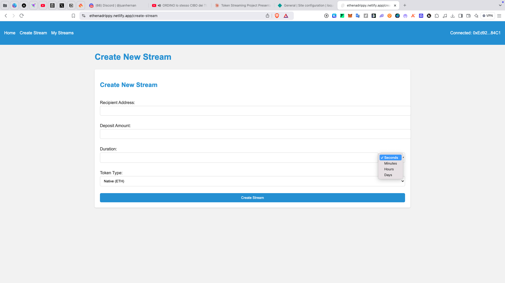
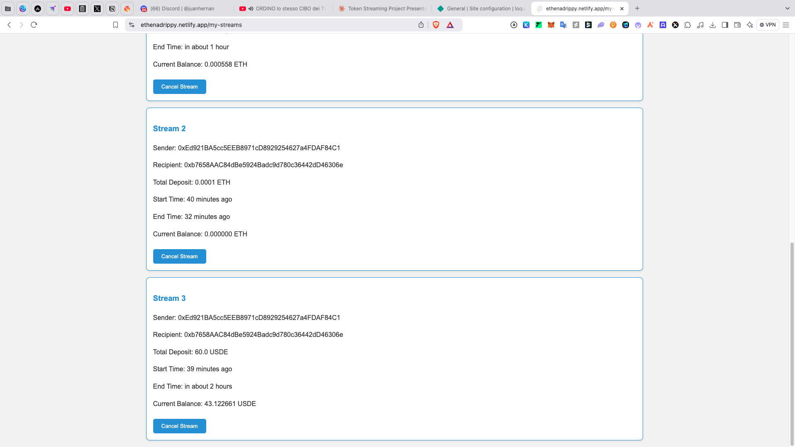

# 💧 Drippy

Drippy is a token streaming protocol built on the Ethena BLE testnet that enables real-time, continuous payments for ETH and USDe tokens. Think of it as your own decentralized payment streaming service.

## 🚀 Features

- Stream ETH and USDe tokens in real-time
- Create customizable payment streams with flexible durations
- Cancel streams with automatic fair balance distribution
- Withdraw available funds at any time
- Secure implementation with reentrancy protection
- Modern SvelteKit frontend for easy interaction

## 🛠 Tech Stack

### Smart Contracts
- Solidity ^0.8.0
- OpenZeppelin Contracts
- Remix

### Frontend
- SvelteKit
- ethers.js
- Web3Modal


## 💻 Usage

### Creating a Stream
```solidity
// Create a USDe stream
uint256 streamId = drippy.createStream(
    recipient,  // Address of the recipient
    amount,     // Amount to stream
    duration,   // Duration in seconds
    false       // isNative (false for USDe, true for ETH)
);
```

### Withdrawing from a Stream
```solidity
// Withdraw available balance
drippy.withdrawFromStream(streamId, amount);
```

### Canceling a Stream
```solidity
// Cancel stream and distribute remaining balance
drippy.cancelStream(streamId);
```

## 🔐 Security

- Built with OpenZeppelin's secure contract library
- Implements ReentrancyGuard for all sensitive functions
- Comprehensive input validation
- Balance checks before transfers

## 📄 Contract Addresses

- Drippy Ethena BLE Testnet: `0x315c7B1205FcbDC5c8c38C2A4CAA7de0b890Fc2f`


## 🙏 Acknowledgments

- OpenZeppelin for secure contract libraries
- Ethena team for the BLE testnet
- Superfluid for inspiration on token streaming mechanics


## 📸 Screenshots






